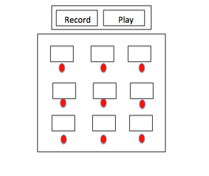
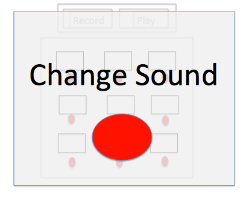

# Background and Overview

-BeatBoxer3000 is an app that allows a user to record their own sounds and then use a drum machine to make beats with those sounds. A user can record and playback their beat. 

# Functionality & MVP

- Upon a keypress users can create a basic pad that can play a sound
- Users can record their own audio and add it to chosen pad. 
- Users can record their beat and have it played back. 

# Wireframe
## Normal app view:

## Modal for recording a pad sound:

# Architecture and Technology 

- Javascript
- Google Firebase

# Implementation Timeline

- Day 1: Research and implement how to setup a drum machine that on a click or keypress pre-created audio files. Animate keypresses to imitate a pad press. 

- Day 2: Research and implement how to let users record audio. Assign to the appropriate pad. Potentially create a countdown to recording in order to minmize lag. 

- Day 3: Create a recording functionality that can store when a note pad was played and achieve playback functionality. If there is time - store these recordings in a database and create a shareable link. 

# BONUS

- Store recordings in database and have shareable link